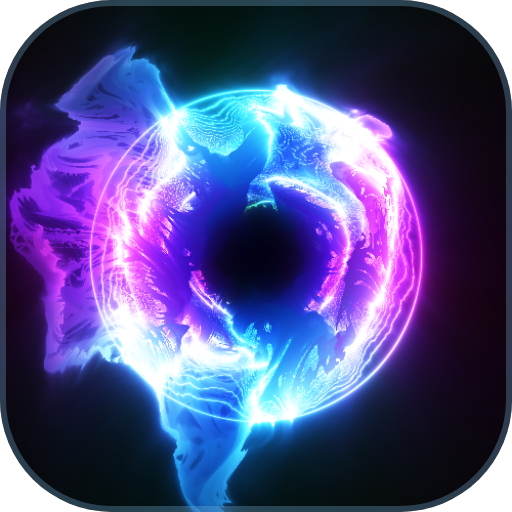

# Omnix

**NixOS with the standard Linux layout, and a choice of systems at install time.**

Omnix has two parts:

1. **A base:** NixOS (unstable) plus a small layer that gives it the standard library
   layout other distributions have. Prebuilt software then just runs: manylinux wheels,
   rustup, vendor SDKs, AppImages, Electron apps.
2. **An installer:** a small ISO that asks *"What kind of system do you want?"* and
   installs the flavor you choose over the network, straight from `cache.nixos.org`.

```
Omnix installer
  ▸ What kind of system do you want?
      KDE Plasma - Atrium      polished windows, mouse-first KDE desktop
      Hyprland - Omarchy       Omarchy-style keyboard-driven Hyprland (stable or latest)
      Minimal                  just the base
```

## The FHS problem

On NixOS, a binary built for "Linux" usually fails to start:

```console
$ ./some-vendor-tool
bash: ./some-vendor-tool: cannot execute: required file not found
```

It needs `/lib64/ld-linux-x86-64.so.2`, `/usr/lib`, and `/usr/bin/python3`, which every
other distribution provides. The Omnix base adds them using tools nixpkgs already ships:
[nix-ld](https://github.com/nix-community/nix-ld) and
[envfs](https://github.com/Mic92/envfs). It never relocates the Nix store, so it can use the same
prebuilt packages as NixOS from the official binary cache and compile when necessary.

## Flavors

Desktop labels follow the [naming policy](docs/naming.md).

A flavor is a flake that turns the base into a complete system. Each one lives in its
own repository:

| Flavor | What it is |
|---|---|
|  [KDE Plasma - Atrium](https://github.com/Omnix-Linux/Atrium) | KDE Plasma desktop, polished windows, mouse-first |
|  [Hyprland - Omarchy](https://github.com/Omnix-Linux/Autarchy) | A port of Omarchy, in *stable* (a pinned Omarchy release) and *latest* variants |
| Minimal | The base alone |

The installed system is a flake that **you** own. The flavor is just one input. You
switch flavors by changing that input and rebuilding, and you can return to the
previous one from the boot menu.

## Small on purpose

- **No packages of its own.** Everything comes from nixpkgs and `cache.nixos.org`.
- **No infrastructure** beyond a minimal installer ISO on GitHub Releases. There is no
  binary cache, channel, or website.
- **Opinions live in flavors.** The base only provides FHS compatibility.

## Status

**Preview.** Download the installer from
[Releases](https://github.com/Omnix-Linux/Omnix/releases), boot it, and run
`sudo omnix-install`. To add the base to an existing NixOS (unstable) flake
instead:

```nix
inputs.omnix = { url = "github:Omnix-Linux/Omnix"; inputs.nixpkgs.follows = "nixpkgs"; };
# modules = [ omnix.nixosModules.default ... ];
```

`nix flake check` boots the base in a VM and runs downloaded binaries against
it. `tests/install-qemu.py` installs the ISO unattended and boots the result.
See [design](docs/design.md), [prior art](docs/prior-art.md),
[roadmap](docs/roadmap.md), and the registry, [`flavors.json`](flavors.json).

## Relationship to NixOS

Omnix is independent and not affiliated with or endorsed by the NixOS Foundation. It
depends entirely on nixpkgs, NixOS, and the public `cache.nixos.org`. Small fixes that
belong upstream go upstream.

## Catalog compatibility checks

The Apps catalog has separate terminal, browser and communication checks:

```sh
nix build .#checks.x86_64-linux.apps-terminals
nix build .#checks.x86_64-linux.apps-browsers
nix build .#checks.x86_64-linux.apps-communication
```

Each check boots an Omnix VM with the desktop library preset and an X11 session,
then launches clients as an ordinary user. Screenshots are saved in the check
output. These checks complement the existing vendor-binary checks; they do not
replace Kitty, Brave, Telegram, Signal or Slack coverage.

- **Terminals:** WezTerm, Alacritty, Ghostty and xterm exercise a shell, PTY,
  terminfo and typed input. tmux exercises a two-pane session, input, attachment
  and persistence after detachment.
- **Browsers:** Chrome, Chromium, Firefox and the hash-pinned upstream Helium
  release load a local HTML page and execute JavaScript with fresh profiles.
  Chromium-based clients retain their sandbox.
- **Communication:** Discord, Element and Thunderbird exercise desktop startup
  without external accounts. Element uses an isolated unlocked GNOME keyring
  and `--password-store=gnome-libsecret`, preserving encrypted credential storage.
  Discord may only reach its network-dependent updater in the VM; a visible
  bootstrap window is not evidence of sign-in readiness. Messaging, calls and
  mail delivery are outside this check's scope.

Native applications come from the locked nixpkgs revision. Chrome and Discord
are explicitly allowed unfree packages in these test VMs. These checks do not
claim Wayland, hardware acceleration or complete application compatibility.
